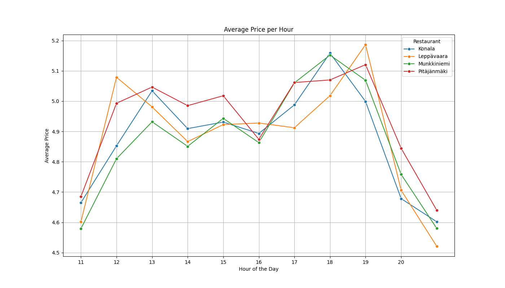
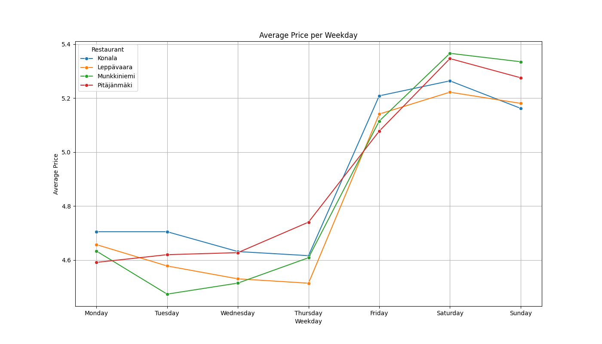
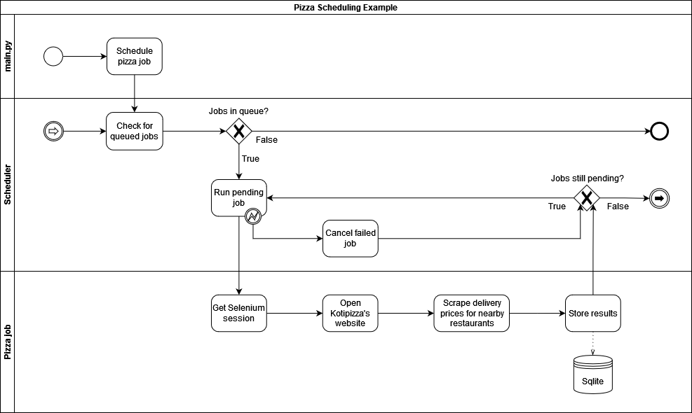

This is an upload from 2023.

-----

# Pizza Delivery Price Tracker
The tool automates the process of scraping dynamic delivery prices from Kotipizza restaurants and storing the data in 
an SQLite database. The project leverages the `schedule` library with custom extensions to allow scheduled jobs to 
return values and handle exceptions gracefully. The process runs silently in the background and shutsdown once data
cannot be fetched anymore when the restaurants close. There is an included data visualizer to create a few example graphs
from the sourced data.

## Features

 - **Automated Silent Data Scraping:** Runs in headless mode to collect data in the background while the system is powered on
 - **Lightweight Data Storage:** Collected data is stored in a local SQLite3 database which enables uncomplicated data processing without servers
 - **Extended Scheduler:** Custom features that allow the `schedule` library to return outputs from jobs and handle exceptions

## Installation & Usage

1. Clone the repository:
```bash
git clone https://github.com/juhotk/pizza_delivery_prices.git
```
2. Install dependencies:
```bash
pip install -r requirements.txt
```
3. Setup ChromeDriver for Selenium
```
- Documentation -
ChromeDriver: https://developer.chrome.com/docs/chromedriver
Selenium: https://www.selenium.dev/documentation/
```

Run ```main.py``` to set up the data collection process and
run ```data_visualizer.py``` to generate graphs after data has been collected.

## Sample Visualizations



## Process Diagram
